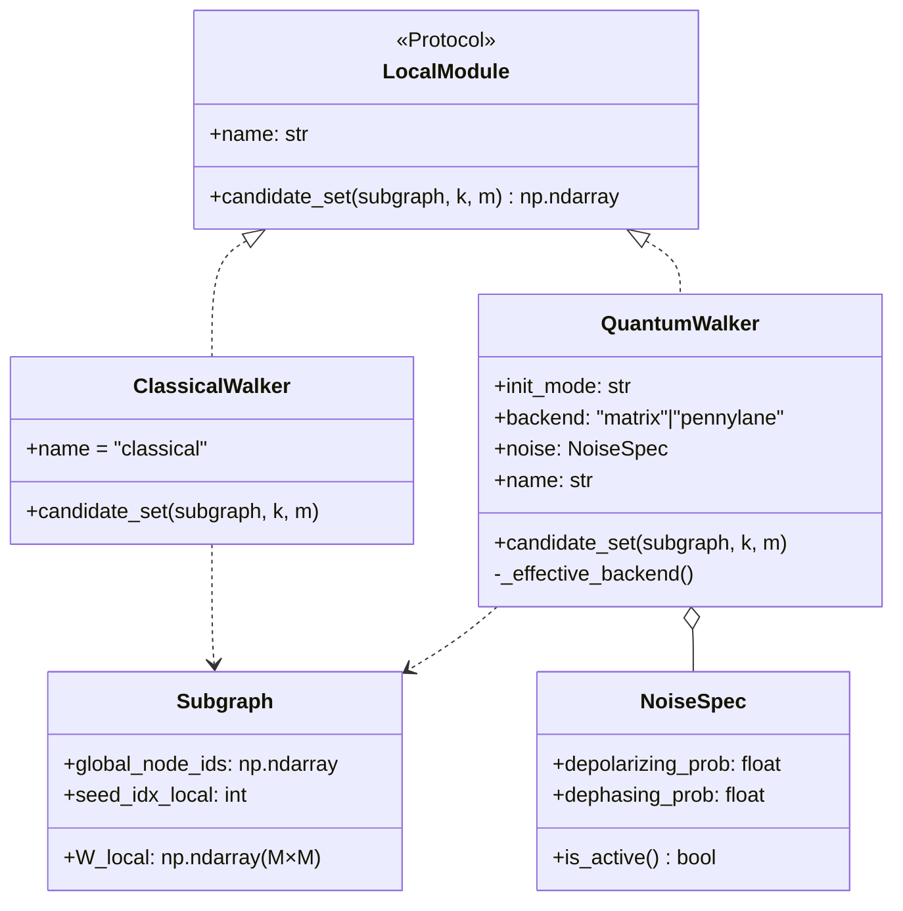
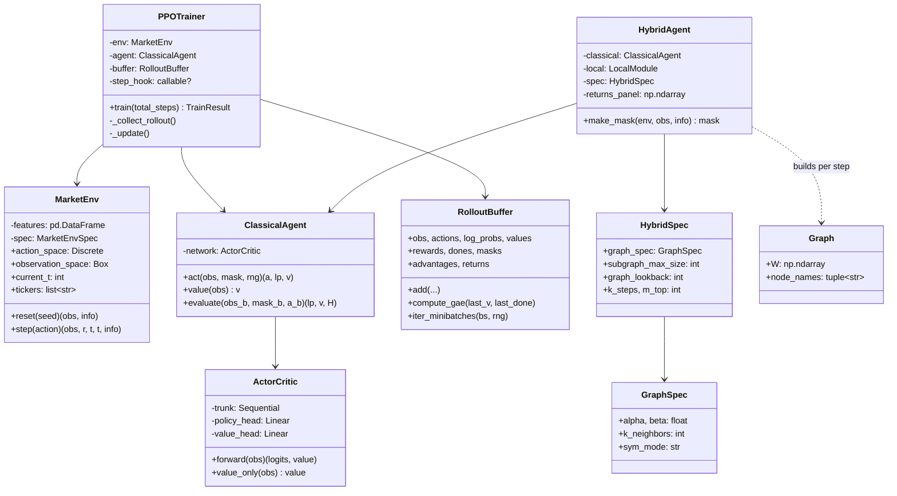
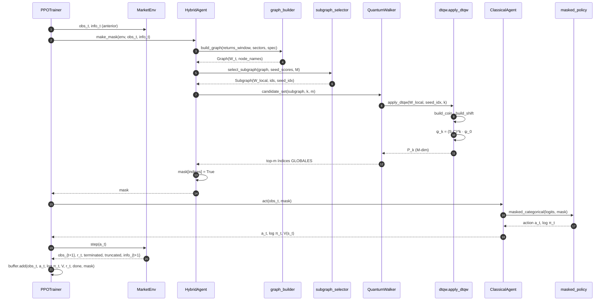
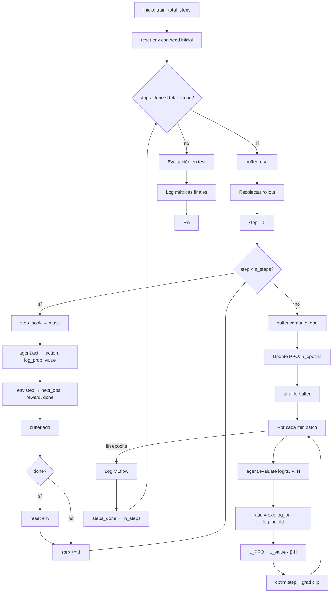
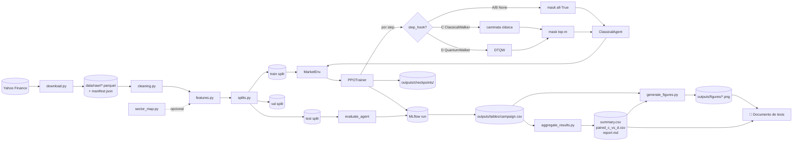
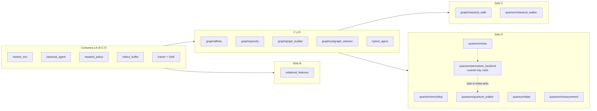
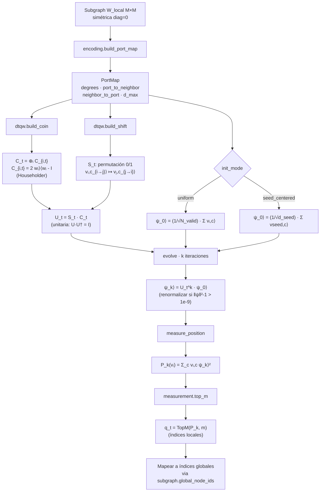

# Arquitectura e Indicaciones para Diagramas

Documento de referencia para construir los diagramas técnicos del proyecto.
Cada sección describe **un punto de vista** del sistema (capas, secuencia,
clases, flujo de datos) y proporciona el **código Mermaid** correspondiente
listo para copiar a la memoria del TFE o a una herramienta de diagramación
(draw.io, Lucidchart, PlantUML, Notion, GitHub).

> Los bloques ```` ```mermaid ```` se renderizan automáticamente en
> GitHub/GitLab y en el preview Markdown de VS Code (extensión *Markdown
> Preview Mermaid Support*).

---

## Tabla de contenidos

1. [Visión general por capas](#1-visión-general-por-capas)
2. [Diagrama de arquitectura del sistema](#2-diagrama-de-arquitectura-del-sistema)
3. [Inventario de componentes](#3-inventario-de-componentes)
4. [Protocolo LocalModule (clave de la ablación)](#4-protocolo-localmodule-clave-de-la-ablación)
5. [Diagrama de clases (componentes principales)](#5-diagrama-de-clases-componentes-principales)
6. [Diagrama de secuencia: un step del Modelo D](#6-diagrama-de-secuencia-un-step-del-modelo-d)
7. [Diagrama de actividad: loop de entrenamiento PPO](#7-diagrama-de-actividad-loop-de-entrenamiento-ppo)
8. [Diagrama de flujo de datos (pipeline E2E)](#8-diagrama-de-flujo-de-datos-pipeline-e2e)
9. [Diagrama de despliegue / runtime](#9-diagrama-de-despliegue--runtime)
10. [Mapa modelo ↔ módulos (los 4 modelos)](#10-mapa-modelo--módulos-los-4-modelos)
11. [Diagrama matemático del módulo cuántico](#11-diagrama-matemático-del-módulo-cuántico)
12. [Glosario de símbolos y términos](#12-glosario-de-símbolos-y-términos)

---

## 1. Visión general por capas

El sistema se organiza en **siete capas** funcionales, con dependencias
estrictamente descendentes (las capas superiores dependen de las inferiores,
nunca al revés):

| # | Capa | Propósito | Módulos (`src/`) |
|---|---|---|---|
| 1 | **Datos** | Descarga, limpieza y features históricas | `data/` |
| 2 | **Entorno** | Interfaz Gymnasium discreta | `env/` |
| 3 | **Grafo** | Representación relacional `G_t` y subgrafo `H_t` | `graph/` |
| 4 | **Cuántico** | DTQW + walkers (clásico y cuántico) | `quantum/` |
| 5 | **Agente** | PPO discreto + máscara + agente híbrido | `agents/` |
| 6 | **Entrenamiento** | Loop PPO + evaluación + trazabilidad | `training/` |
| 7 | **CLI / orquestación** | Comandos, campañas, ablaciones | `main.py`, `scripts/` |

Todo descansa sobre `utils/` (paths, config pydantic, hashing, logging).

---

## 2. Diagrama de arquitectura del sistema

```mermaid
flowchart TB
    subgraph DataLayer["📁 1. Capa de datos"]
        DL1[download.py<br/>yfinance + manifest SHA-256]
        DL2[cleaning.py<br/>alineación temporal]
        DL3[features.py<br/>retornos, vol, RSI<br/>· shift(1) defensivo ·]
        DL4[splits.py<br/>train/val/test cronológico]
        DL5[sector_map.py<br/>GICS]
        DL1 --> DL2 --> DL3 --> DL4
        DL5 -.opcional.-> DL3
    end

    subgraph EnvLayer["🎮 2. Entorno Gymnasium"]
        EL1[market_env.py<br/>MarketEnv · Discrete N]
        EL2[reward.py<br/>r_t = R - λσ - μc]
        EL3[state_builder.py<br/>s_t = ventana L]
        EL4[episode_sampler.py]
        EL1 --> EL2
        EL1 --> EL3
        EL1 --> EL4
    end

    subgraph GraphLayer["🕸️ 3. Capa de grafo"]
        GL1[affinity.py<br/>α·corr + β·sector]
        GL2[sparsify.py<br/>k-NN simetrizado]
        GL3[graph_builder.py<br/>G_t = V,E_t,W_t]
        GL4[subgraph_selector.py<br/>H_t por BFS ponderada]
        GL5[relational_features.py<br/>rasgos del grafo]
        GL6[classical_walk.py<br/>caminata D⁻¹W]
        GL1 --> GL2 --> GL3 --> GL4
        GL3 -.-> GL5
        GL3 -.-> GL6
    end

    subgraph QLayer["⚛️ 4. Módulo cuántico"]
        QL1[encoding.py<br/>puertos locales]
        QL2[dtqw.py<br/>U_t = S·C matricial]
        QL3[measurement.py<br/>TopM]
        QL4[classical_walker.py<br/>fachada Modelo C]
        QL5[quantum_walker.py<br/>fachada Modelo D]
        QL6[pennylane_backend.py<br/>NISQ + ruido]
        QL7[noise.py<br/>depolarizing/dephasing]
        QL1 --> QL2 --> QL3
        QL2 --> QL5
        QL6 --> QL5
        QL7 --> QL6
        GL6 -.-> QL4
    end

    subgraph AgentLayer["🤖 5. Agentes"]
        AL1[policy_network.py<br/>ActorCritic MLP]
        AL2[masked_policy.py<br/>NEG_INF=-1e9]
        AL3[rollout_buffer.py<br/>incluye mask_t]
        AL4[classical_agent.py<br/>Modelos A·B]
        AL5[hybrid_agent.py<br/>Modelos C·D]
        AL1 --> AL4
        AL2 --> AL4
        AL3 --> AL4
        AL4 --> AL5
    end

    subgraph TrainLayer["🏋️ 6. Entrenamiento"]
        TL1[trainer.py<br/>PPO + GAE]
        TL2[evaluate.py<br/>métricas Cap 8.16]
        TL3[mlflow_logger.py]
        TL4[seed_utils.py]
    end

    subgraph CLILayer["⚡ 7. CLI / Orquestación"]
        CL1[main.py<br/>typer]
        CL2[run_campaign.py<br/>4 × N seeds]
        CL3[run_ablation.py<br/>Cap 8.20]
        CL4[aggregate_results.py<br/>bootstrap D vs C]
        CL5[generate_figures.py]
    end

    DataLayer --> EnvLayer
    DataLayer --> GraphLayer
    EnvLayer --> AgentLayer
    GraphLayer --> AgentLayer
    QLayer --> AgentLayer
    AgentLayer --> TrainLayer
    EnvLayer --> TrainLayer
    TrainLayer --> CLILayer
    CLILayer -.lee.-> DataLayer
```

---

## 3. Inventario de componentes

### 3.1. Capa de datos (`src/data/`)

| Módulo | Responsabilidad | Entradas | Salidas |
|---|---|---|---|
| `download.py` | Descargar OHLCV de Yahoo Finance | tickers, fechas | parquets + `manifest.json` (SHA-256) |
| `cleaning.py` | Alinear multi-ticker, eliminar NaN | dict ticker→DataFrame | DataFrame multi-index (ticker, OHLCV) |
| `features.py` | Computar features sin fuga temporal | DataFrame limpio + `FeatureSpec` | DataFrame multi-index (ticker, feature) |
| `splits.py` | Partición cronológica train/val/test | DataFrame + `SplitSpec` | `{"train": df, "val": df, "test": df}` |
| `sector_map.py` | Mapear tickers a sectores GICS | lista tickers | dict ticker→sector |

### 3.2. Capa de entorno (`src/env/`)

| Módulo | Responsabilidad | Contrato clave |
|---|---|---|
| `market_env.py` | `MarketEnv(gym.Env)` | `step → (obs, r, terminated, truncated, info)` con `info["candidate_mask"]` |
| `reward.py` | Recompensa pura: `r_t = R - λσ - μc` | función pura, sin estado |
| `state_builder.py` | Aplanar ventana L de features en vector 1D float32 | `state_shape = (L·N·d,)` |
| `episode_sampler.py` | Generar inicios de episodio reproducibles | random o sequential, semilla fija |

### 3.3. Capa de grafo (`src/graph/`)

| Módulo | Responsabilidad | Salida |
|---|---|---|
| `affinity.py` | `A_t = α·max(0, corr) + β·sector`, normalización [0,1] | matriz (N×N) |
| `sparsify.py` | k-NN simetrizado (`avg`/`mutual`/`max`) | matriz (N×N) esparsa |
| `graph_builder.py` | Orquesta affinity + sparsify | `Graph(W, node_names)` |
| `subgraph_selector.py` | Seed score + BFS ponderada hasta tamaño M | `Subgraph(W_local, ids, seed_idx)` |
| `relational_features.py` | Degree, clustering, embedding espectral | matriz (N×d_rel) |
| `classical_walk.py` | Caminata aleatoria `p = (D⁻¹W)ᵀᵏ e_seed` | vector probabilidades |

### 3.4. Módulo cuántico (`src/quantum/`)

| Módulo | Responsabilidad | Salida |
|---|---|---|
| `encoding.py` | Puertos locales, padding `d_max` | `PortMap` (degrees, port_to_neighbor, ...) |
| `dtqw.py` | `build_coin`, `build_shift`, `apply_dtqw` (matricial) | `P_k(v_i)` (M-dim) |
| `measurement.py` | `top_m` con exclusiones | índices locales del top-m |
| `classical_walker.py` | Fachada del Modelo C (cumple `LocalModule`) | índices globales top-m |
| `quantum_walker.py` | Fachada del Modelo D (cumple `LocalModule`) | índices globales top-m |
| `pennylane_backend.py` | DTQW vía PennyLane con padding a 2^n | `P_k` (para ruido) |
| `noise.py` | `NoiseSpec` + canales `qml.DepolarizingChannel` | aplica ruido por gate |

### 3.5. Capa de agentes (`src/agents/`)

| Módulo | Responsabilidad |
|---|---|
| `policy_network.py` | `ActorCritic`: tronco MLP + cabeza policy + cabeza valor |
| `masked_policy.py` | `masked_logits = logits.masked_fill(~mask, -1e9)`; `Categorical`, log-prob, entropía |
| `rollout_buffer.py` | Buffer PPO con campo **`masks`** almacenado; GAE; minibatching |
| `classical_agent.py` | Modelos A y B (PPO puro con máscara externa del env) |
| `hybrid_agent.py` | Modelos C y D (compone classical_agent + `LocalModule`) |

### 3.6. Capa de entrenamiento (`src/training/`)

| Módulo | Responsabilidad |
|---|---|
| `trainer.py` | `PPOTrainer.train()`: rollout → GAE → n_epochs update con clipping |
| `evaluate.py` | `EvalResult`: financiero, learning, exploración (top-m hit-rate), latencia |
| `mlflow_logger.py` | Wrapper minimal: `start_run`, `log_params`, `log_metrics`, `log_artifact` |
| `seed_utils.py` | `set_global_seed`: random + numpy + torch + cuda |

### 3.7. CLI y orquestación

| Archivo | Comando | Propósito |
|---|---|---|
| `src/main.py` | `download`, `train` | Comandos individuales con typer |
| `scripts/run_campaign.py` | (CLI propio) | 4 modelos × N semillas → CSV agregado |
| `scripts/run_ablation.py` | `init`, `noise`, `M`, `k`, `m` | Ablaciones Cap. 8.20 |
| `scripts/aggregate_results.py` | (CLI propio) | Bootstrap pareado D vs C + reporte MD |
| `scripts/generate_figures.py` | (CLI propio) | PNGs para la tesis |

---

## 4. Protocolo LocalModule (clave de la ablación)

El **único punto de variación entre C y D** es el productor del conjunto
candidato top-m. Ambos cumplen el mismo `Protocol`:



**Implicación experimental**: cambiar de C a D requiere modificar **una línea
del YAML** (`agent.model: C` → `agent.model: D`). Toda la maquinaria
restante es idéntica, lo que garantiza que la comparación aísla el efecto
exclusivo de la DTQW (Cap. 5.10.4 del documento).

---

## 5. Diagrama de clases (componentes principales)



---

## 6. Diagrama de secuencia: un step del Modelo D

Detalla **qué pasa entre `env.step()` y `env.step()`** cuando el agente es
híbrido D. Es el flujo más complejo del sistema.



**Notas operativas**:
- En **Modelo A**: pasos 2-13 se omiten; `mask = ones(N)`.
- En **Modelo B**: pasos 3-4 ocurren (para rasgos relacionales en el estado), pero 5-12 se omiten.
- En **Modelo C**: paso 7 invoca `ClassicalWalker.candidate_set` que internamente llama a `random_walk_distribution` en vez de `apply_dtqw`.

---

## 7. Diagrama de actividad: loop de entrenamiento PPO



---

## 8. Diagrama de flujo de datos (pipeline E2E)

Trazado desde **Yahoo Finance** hasta las **figuras finales de la tesis**.



---

## 9. Diagrama de despliegue / runtime

```mermaid
flowchart TB
    subgraph Local["💻 Workstation local (Windows / Linux / macOS)"]
        UV[uv 0.11.8<br/>gestor de entorno]
        VENV[".venv/<br/>Python 3.13.13"]
        UV --> VENV
        VENV --> PROC[Proceso Python<br/>uv run python ...]

        subgraph Procesos["Procesos en runtime"]
            PROC --> P1[Trainer PPO]
            PROC --> P2[Agente PPO+DTQW]
            PROC --> P3[Backend cuántico]
        end

        subgraph FS["Sistema de archivos"]
            FS1[data/raw/...<br/>OHLCV parquets]
            FS2[outputs/mlruns/<br/>MLflow file-store]
            FS3[outputs/checkpoints/<br/>PyTorch .pt]
            FS4[outputs/tables/<br/>CSVs agregados]
            FS5[outputs/figures/<br/>PNGs]
        end

        Procesos -.read.-> FS1
        Procesos -.write.-> FS2
        Procesos -.write.-> FS3
        Procesos -.write.-> FS4
        Procesos -.write.-> FS5
    end

    subgraph Remoto["☁️ Externo (sólo descarga inicial)"]
        Y[(Yahoo Finance API)]
    end

    FS1 <-.HTTPS.- Y

    USER[👤 Usuario] --> CLI[tasks.ps1]
    CLI --> UV

    MLFUI[mlflow ui<br/>localhost:5000] -.lee.-> FS2
    USER -.HTTP.-> MLFUI
```

---

## 10. Mapa modelo ↔ módulos (los 4 modelos)

Tabla cruzada que muestra **qué módulos invoca cada modelo** durante un step:



| Componente | A | B | C | D |
|---|:-:|:-:|:-:|:-:|
| `MarketEnv` | ✅ | ✅ | ✅ | ✅ |
| `ClassicalAgent` + `masked_policy` | ✅ | ✅ | ✅ | ✅ |
| `PPOTrainer` + `RolloutBuffer` | ✅ | ✅ | ✅ | ✅ |
| `Graph` (affinity + sparsify) | ❌ | ✅ | ✅ | ✅ |
| `relational_features` | ❌ | ✅ | ❌ | ❌ |
| `Subgraph` (BFS) | ❌ | ❌ | ✅ | ✅ |
| `HybridAgent` | ❌ | ❌ | ✅ | ✅ |
| `ClassicalWalker` (caminata D⁻¹W) | ❌ | ❌ | ✅ | ❌ |
| `QuantumWalker` + `dtqw` | ❌ | ❌ | ❌ | ✅ |
| `pennylane_backend` + `noise` | ❌ | ❌ | ❌ | sólo ablación |

---

## 11. Diagrama matemático del módulo cuántico

Visualización del flujo de cómputo dentro de `apply_dtqw`:



---

## 12. Glosario de símbolos y términos

| Símbolo / Término | Significado | Módulo principal |
|---|---|---|
| `s_t` | Estado clásico observado en `t` | `state_builder.py` |
| `u_t` (`a_t`) | Acción discreta seleccionada (índice de activo) | `market_env.py` |
| `r_t` | Recompensa instantánea `R - λσ - μc` | `reward.py` |
| `G_t = (V, E_t, W_t)` | Grafo dinámico no dirigido ponderado | `graph_builder.py` |
| `H_t ⊂ G_t` | Subgrafo local alrededor del nodo semilla | `subgraph_selector.py` |
| `v_seed,t` | Nodo semilla = `argmax_i (mean(r_i) / (std(r_i) + ε))` | `subgraph_selector.py` |
| `M` | Tamaño máximo del subgrafo | config `graph.subgraph_max_size` |
| `k` | Pasos de la caminata (clásica o cuántica) | config `quantum.k_steps` |
| `m` | Tamaño del conjunto candidato top-m | config `quantum.m_top` |
| `q_t` | Conjunto top-m producido por el LocalModule | `LocalModule.candidate_set` |
| `π_c(u\|s)` | Política clásica categórica (PPO) | `classical_agent.py` |
| `π_eff(u\|s, C_t)` | Política efectiva enmascarada: `π_c · 1[u∈C_t] / Σ π_c` | `masked_policy.py` |
| `C_t` | Operador moneda cuántica (Householder por nodo) | `dtqw.build_coin` |
| `S_t` | Operador shift (permutación entre puertos recíprocos) | `dtqw.build_shift` |
| `U_t = S_t · C_t` | Operador unitario de un paso DTQW | `dtqw.evolve` |
| `\|ψ_k⟩` | Estado cuántico tras `k` pasos | `dtqw.evolve` |
| `P_k(v_i)` | Probabilidad marginal de medir el nodo `i` | `dtqw.measure_position` |
| `d_i`, `d_max` | Grado del nodo / máximo grado del subgrafo | `encoding.PortMap` |
| `L`, `L_t`, `L_s` | Ventana del estado / del grafo / del seed score | configs |
| `α`, `β` | Pesos de mezcla en la afinidad `α·corr + β·sector` | `graph.affinity` |
| `λ`, `μ` | Coeficientes de penalización (riesgo, costos) | `env.reward` |

### Acrónimos

| Sigla | Significado |
|---|---|
| **PPO** | Proximal Policy Optimization |
| **GAE** | Generalized Advantage Estimation |
| **DTQW** | Discrete-Time Quantum Walk |
| **OHLCV** | Open / High / Low / Close / Volume |
| **GICS** | Global Industry Classification Standard |
| **NISQ** | Noisy Intermediate-Scale Quantum |
| **MDP / POMDP** | (Partially Observable) Markov Decision Process |

---

## Sugerencias para diagramar la tesis

Para el documento de tesis (Cap. 5 — Arquitectura y Cap. 7 — Grafo / Módulo
cuántico), recomendamos al menos **tres diagramas obligatorios**:

1. **Arquitectura general por capas** (§2 de este documento) — visión
   ejecutiva al inicio del Cap. 5.
2. **Diagrama de secuencia de un step del Modelo D** (§6) — muestra la
   integración crítica que constituye el núcleo de la contribución.
3. **Flujo matemático del módulo cuántico** (§11) — soporta la Sec. 7.10-7.17.

Opcionales pero recomendados:
- **Flujo de datos E2E** (§8) — útil para el Cap. 4 (metodología) y Cap. 8
  (diseño experimental).
- **Mapa modelo ↔ módulos** (§10) — justifica visualmente la ablación A→B→C→D.
- **Diagrama de clases** (§5) — apéndice técnico.

### Herramientas sugeridas

| Herramienta | Cuándo usar |
|---|---|
| **Mermaid** (este documento) | Edición rápida, integración con README/GitHub, diagramas conceptuales |
| **draw.io / diagrams.net** | Diagramas de arquitectura para PDF de tesis, control fino de estilos |
| **PlantUML** | Diagramas UML formales (clases, secuencia) con sintaxis robusta |
| **TikZ** (LaTeX) | Si la tesis usa LaTeX y se busca consistencia tipográfica |
| **Excalidraw** | Diagramas más "boceto", útil para defender oralmente |

Para convertir un diagrama Mermaid a SVG/PNG:

```powershell
# Instalar mmdc (Mermaid CLI)
npm install -g @mermaid-js/mermaid-cli

# Convertir a SVG
mmdc -i docs/architecture.md -o outputs/figures/diagrams.svg
```

---

*Documento generado para la tesis "Exploración cuántica estructurada en aprendizaje por refuerzo híbrido para selección de activos" (UNIR, abril 2026).*
