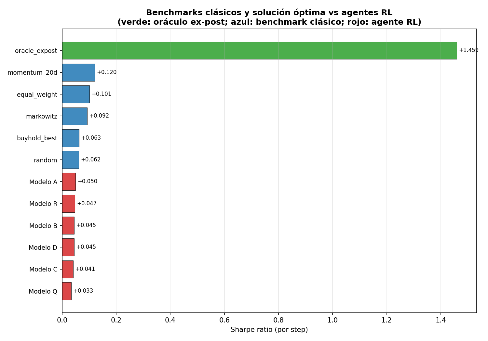
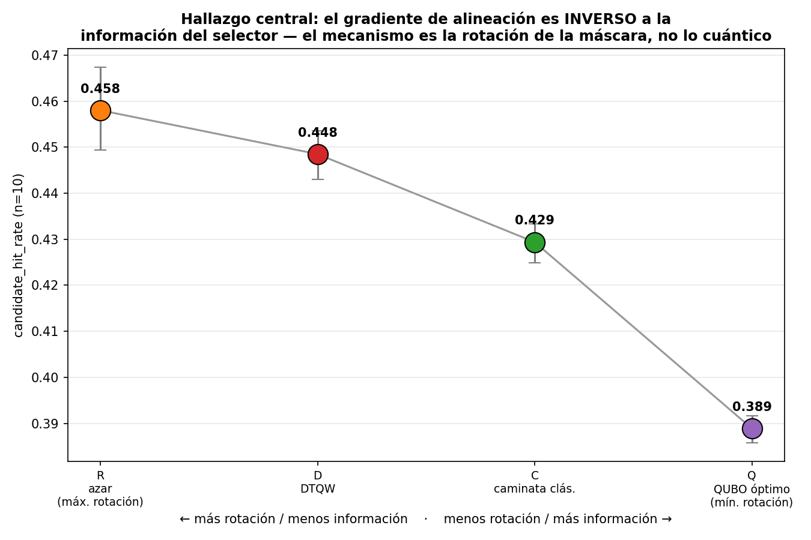
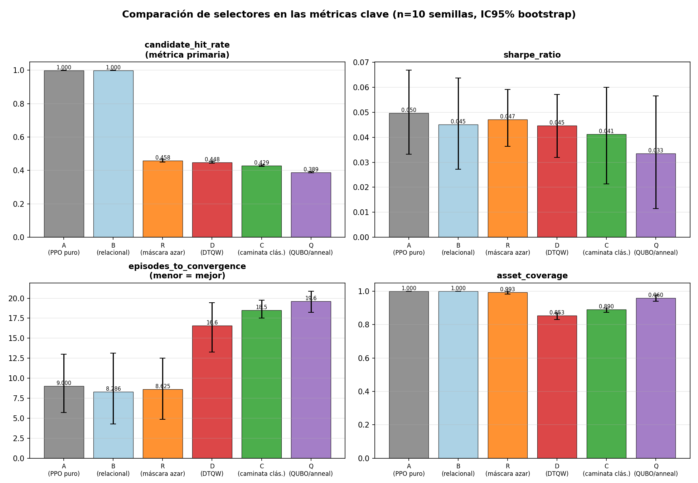
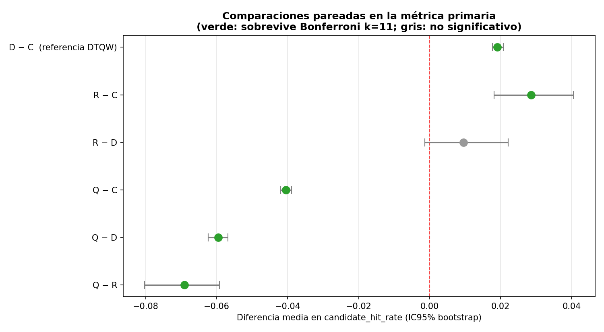
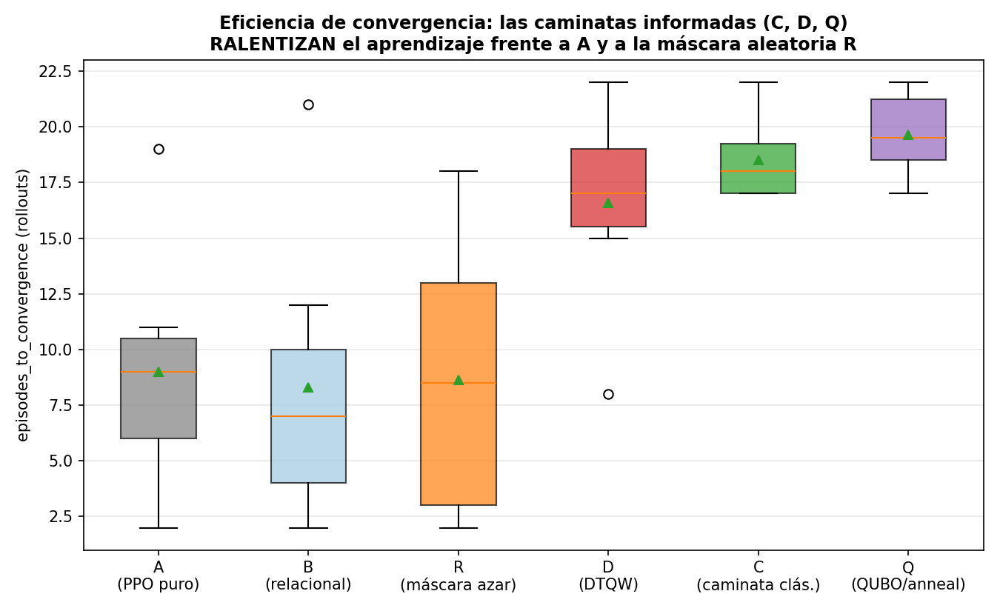
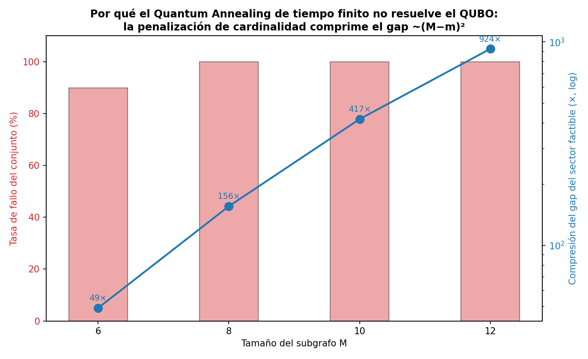

# Resultados experimentales v6 — Material de presentación

**Proyecto**: Exploración cuántica estructurada en RL híbrido para selección de activos
**Autor**: Oscar Fernando Bonilla Suárez — UNIR · **Tag**: `v6-final`

> Este documento agrupa las **figuras** y **tablas comparativas** listas para
> presentar los experimentos del feedback de dirección. Las figuras están en
> `outputs/figures/v6/` (PNG, 150 dpi) y las tablas en `outputs/tables/v6/`
> (Markdown y LaTeX). Para regenerar todo:
> `uv run python scripts/v6_presentation_figures.py`.

---

## Guion de la presentación en una frase

> *El efecto "cuántico" que confirmamos con rigor estadístico
> (candidate_hit_rate D>C, p<0.001) resulta NO ser cuántico: una máscara
> aleatoria lo iguala. El mecanismo real es la rotación de la máscara, una
> propiedad de la formulación RL. Ni la DTQW, ni los pesos de afinidad, ni el
> Quantum Annealing en su límite ideal aportan ventaja atribuible al
> componente cuántico.*

---

## Mapa de figuras ↔ mensaje

| Figura | Mensaje de la diapositiva |
|---|---|
| `fig_gradiente_seleccion.png` | **El hallazgo central.** Cuanto más informado el selector, peor la alineación: R > D > C > Q. |
| `fig_selectores_metricas.png` | Comparación completa de los 6 selectores en las 4 métricas clave. |
| `fig_benchmarks_sharpe.png` | El agente RL no supera benchmarks simples (punto 1). |
| `fig_forest_pareado.png` | Significancia estadística de cada comparación pareada (Bonferroni). |
| `fig_convergencia.png` | Las caminatas informadas ralentizan la convergencia. |
| `fig_annealing_fidelidad.png` | Por qué el Quantum Annealing finito no resuelve el QUBO (punto 3). |

---

## Punto 1 — ¿Compite el método con estrategias estándar?

**Respuesta: no en Sharpe.** Momentum simple y la cartera 1/N superan a todos
los agentes RL; el oráculo ex-post marca la cota superior teórica.

| Estrategia | Familia | Sharpe | topm_hit | coverage |
|---|---|---|---|---|
| oracle_expost | discreta (óptimo) | **+1.459** | 0.343 | 0.987 |
| momentum_20d | discreta | **+0.120** | **0.241** | 0.693 |
| equal_weight | cartera 1/N | +0.101 | — | 1.000 |
| markowitz | cartera tangente | +0.092 | — | 0.567 |
| buyhold_best | discreta | +0.063 | 0.180 | 0.033 |
| random | discreta | +0.062 | 0.201 | 1.000 |
| *Modelos RL (A–Q)* | RL | *+0.033…+0.050* | *0.161…0.201* | *0.85…1.00* |

**Para decir en la defensa**: el agente captura ~3% del Sharpe del oráculo y
queda por debajo de momentum 20d incluso en `topm_hit_rate` (0.241 vs ≤0.201).
La contribución del trabajo es **metodológica**, no de utilidad financiera. Esto
acota honestamente cualquier afirmación de rendimiento.

---

## Punto 2 — ¿La ventaja viene del módulo cuántico o de la formulación RL?

**Respuesta: de la formulación.** El control definitivo es el **Modelo R**: una
máscara aleatoria de tamaño *m* sobre el mismo subgrafo, sin información alguna.

### 2a. El gradiente de alineación (figura central)

El orden por `candidate_hit_rate` es **R (0.458) > D (0.448) > C (0.429) >
Q (0.389)** — monótono e **inverso** a la informatividad del selector. La
máscara aleatoria (máxima rotación, cero información) gana; el óptimo QUBO
(máxima información, cero rotación) pierde.

### 2b. Comparación de los 6 selectores en las 4 métricas

| Selector | Sharpe | cand_hit | topm_hit | coverage | converg. | lat.(ms) |
|---|---|---|---|---|---|---|
| A (PPO puro) | +0.050 | 1.000* | 0.199 | 1.000 | 9.0 | 0.40 |
| B (relacional) | +0.045 | 1.000* | 0.201 | 1.000 | 8.3 | 0.48 |
| **R (máscara azar)** | +0.047 | **0.458** | 0.187 | 0.993 | **8.6** | 0.75 |
| D (DTQW) | +0.045 | 0.448 | 0.183 | 0.853 | 16.6 | 1.29 |
| C (caminata clás.) | +0.041 | 0.429 | 0.178 | 0.890 | 18.5 | 0.75 |
| Q (QUBO/anneal) | +0.033 | 0.389 | 0.161 | 0.960 | 19.6 | 1.00 |

> *A y B usan máscara `all-True` (sin filtrado): su `candidate_hit_rate`=1.000
> es trivial, no comparable con los selectores con subgrafo.

### 2c. Significancia estadística (bootstrap pareado, Bonferroni k=11)

**Lecturas clave del análisis pareado** (`tabla_pareado.md` para el detalle):
- **R − C** en `candidate_hit_rate`: **+0.029** (p_Bonf < 0.001) — la máscara
  aleatoria supera a la caminata clásica con **mayor margen** que el propio
  D − C (+0.019).
- **R − D** en `candidate_hit_rate`: +0.010 (p_Bonf = 0.964) — **estadísticamente
  indistinguible**: la DTQW no aporta sobre el azar.
- **R − C** y **R − D** en convergencia: **−8.3** y **−6.4 rollouts**
  (p_Bonf < 0.001) — R converge mucho antes.

### 2d. Eficiencia de convergencia

R converge en ~8.6 rollouts (como el baseline A), mientras C/D/Q necesitan
16–20. **Las caminatas informadas ralentizan el aprendizaje** en lugar de
acelerarlo.

**Para decir en la defensa**: la cadena de evidencia es consistente y progresiva
— v5 ya mostró que los pesos de afinidad no aportaban (Grover uniforme >
Householder ponderada); v6 cierra el argumento mostrando que la propia caminata
no aporta sobre una selección aleatoria. **H1 se confirma en su formulación
literal, pero su mecanismo es la rotación de la máscara, no la interferencia
cuántica.**

---

## Punto 3 — ¿Aporta el Quantum Annealing?

**Respuesta: no, ni siquiera en su límite ideal.** Implementamos el selector
como un QUBO (cohesión + afinidad al seed + penalización de cardinalidad)
resuelto por annealing adiabático.

### 3a. Por qué el annealing de tiempo finito no resuelve el QUBO

La penalización de cardinalidad domina el espectro: comprime los *gaps* del
sector factible entre **49× (M=6)** y **924× (M=12)**, de modo que el schedule
practicable es fuertemente no-adiabático y falla en alcanzar el estado
fundamental en 18–20 de 20 instancias. *(Hallazgo con interés propio: los QUBO
con cardinalidad penalizada son hostiles para annealers físicos tipo D-Wave.)*

Por eso la campaña usa el **modo exacto** (estado fundamental por enumeración =
límite adiabático ideal T→∞ = cota superior del QA real): si el óptimo no aporta,
el QA físico tampoco.

### 3b. Resultado de campaña (modo exacto, n=10)

| Comparación | cand_hit | p_Bonf | topm_hit | p_Bonf |
|---|---|---|---|---|
| Q − C | **−0.040** | 0.000 | −0.017 | 0.009 |
| Q − D | **−0.060** | 0.000 | −0.022 | 0.000 |
| Q − R | **−0.069** | 0.000 | −0.026 | 0.000 |

**Para decir en la defensa**: la selección QUBO-óptima es **el peor selector de
todos** en alineación. Causa: su determinismo elimina la rotación de la máscara
(el mecanismo operativo identificado en el punto 2). Con la cota superior del QA
descartada, queda **activada la condición** para el cambio metodológico del
punto 4.

---

## Punto 4 — Quantum Reservoir Computing (condición activada)

**Roadmap completo en `docs/qr_roadmap.md`.** Síntesis para la diapositiva de
trabajo futuro:

- **Cambio de naturaleza**: el QR no es un *selector* sino un *extractor de
  features temporales*. Se integra por la interfaz `relational_features_fn` ya
  existente (introducida para el Modelo B): cero cambios en el entorno.
- **Diseño**: reservoir de Ising transverso desordenado (6–8 qubits), lectura
  por observables ⟨Z⟩, ⟨ZZ⟩, ⟨X⟩, simulación matricial densa.
- **Controles obligatorios** (lección de los puntos 2–3): ESN clásico de igual
  dimensión, features aleatorias congeladas, y el Modelo B (cuyo control B−A ya
  resultó nulo — advertencia de techo para cualquier enfoque de aumento de
  estado).
- **Esfuerzo**: 4–5 días de implementación + ~2 h de cómputo.

---

## Resumen de una diapositiva (cierre)

| Pregunta del director | Veredicto | Evidencia |
|---|---|---|
| 1. ¿Compite con benchmarks? | **No en Sharpe** | momentum +0.120 > RL +0.05; oráculo +1.459 |
| 2. ¿Ventaja cuántica o RL? | **De la formulación (rotación de máscara)** | R−D nulo; R−C > D−C; gradiente R>D>C>Q |
| 3. ¿Aporta Quantum Annealing? | **No, ni en límite ideal** | Q el peor selector; Q−C/D/R todos negativos |
| 4. ¿Procede Quantum Reservoir? | **Sí, condición activada** | roadmap con controles pre-registrados |

**Mensaje de cierre**: la contribución del TFE es un **marco metodológico
reproducible y estadísticamente disciplinado** que permitió *aislar, medir y
refutar* el aporte de tres módulos cuánticos sucesivos — con la batería completa
de controles (benchmarks, oráculo, máscara aleatoria, óptimo QUBO) que demostró
imprescindible para no atribuir al componente cuántico efectos que pertenecen a
la formulación.

---

## Índice de artefactos

**Figuras** (`outputs/figures/v6/`):
`fig_gradiente_seleccion.png`, `fig_selectores_metricas.png`,
`fig_benchmarks_sharpe.png`, `fig_forest_pareado.png`, `fig_convergencia.png`,
`fig_annealing_fidelidad.png`.

**Tablas** (`outputs/tables/v6/`, en `.md` y `.tex`):
`tabla_selectores`, `tabla_benchmarks`, `tabla_pareado`.

**Generador**: `scripts/v6_presentation_figures.py` (un comando regenera todo).
